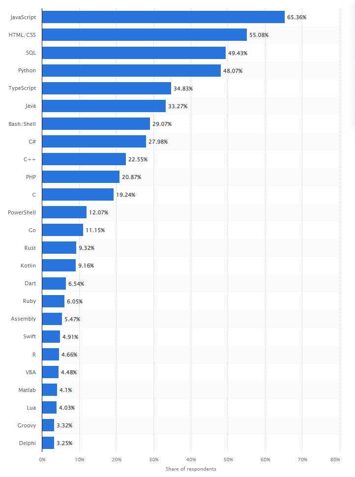

#  LEARN
Go or GoLang is a programming language originally developed by Google that uses high-level syntax similar to scripting languages. Go is created to help in the development of multi-core, networked computers through concurrency, scalability and syntactical clearity.
One Googles main motiviations for developing Go was to replace C with a easy-to-code, easy-to-learn, high-performance alternative.

## <span style="color:yellow">why go?</span>
* future-proof
* easy to learn
* self-containing
* highly scalable
* easy to maintain
* high performance
* statically compiled -> fast
* concurrency is free -> fast
* great career opportunities
* designed for problem-solving



## <span style="color:yellow">get started</span>
* download and install go [here](https://go.dev/doc/install)
* set GOPATH=/home/(somewhere)/golang
* verify installation `go version`
* check go env variables `go env`
* list available commands `go help`
* info pages for a specific command `go help <command>`
* ...
* ready to code?
* ...

## <span style="color:yellow">packages and modules</span>
* packages form the basic building blocks of a Go program
* packages make for re-usable units
* modules are collections of packages
* to make a package executable it must be named `main`
* folder architecture is important
    something like this is quite common

    ```
    src
    └───project
    │   ├─ main.go   | the main
    |   ├─ func.go   | package
    |   ├── pkg
    │   |    ├───greetings
    │   |    |     ├─ hello.go    |
    │   |    |     ├─ goodbye.go  | the greetings
    │   |    |     │  ...         | package
    │   |    | ....
    |   |
    |   ├─ go.sum
    |   └─ go.mod
    |
    └───other-project
        │   go.mod
        │   go.sum
        |   other.go
        |   ...
    ```

## <span style="color:yellow">Create a module</span>
you create a module with the `go mod init myapp` command
this will create a `go.mod` file. This is where all module dependencies will be listed.

If you want your packages downloadable you should give it a name like `github.com/yourname/myapp`.

Initially `go.mod` would look like this:

<span style="color:green">src/go-learn/go.mod</span>
```
module github.com/franktore/go-learn

go 1.18
```

Add some dependencies to your application and start coding. You can add dependencies directly in the code where you will use it. Often the imports will be inferred from the code itself and you won't have to manually add it. 

When you run with `go run .` the `go.mod` file is updated. When some dependencies are missing you can normally get them with the `go get .` command.

<span style="color:green">src/go-learn/learn.go</span>
```
package main

import (
    "fmt"
	"log"
	"math"
)

func main() {
    fmt.Println("weee.. free to go!")

	// some common ways to declear variables
	// you wont get far without them
	var a = "a"
	var b, c int = 1, 2
	var d = true
	var e int
    name := ""

    // similar for constants
    const f rune = 'f'
    const n = 500000000
    const d = 3e20 / n
}
```
Variables can be declared in different ways. GO will infer the `type` of initialized variables.

Run the application using `go run .`

Add a package to you application and create some action.

<span style="color:green">src/go-learn/pkg/greetings/hello.go</span>
```
package greetings

import (
	"errors"
	"fmt"
	"math/rand"
	"time"
	"rsc.io/quote"
)

func Hello(name string) (string, error) {}

func init() {}

func randomFormat() string {}
```

GO is `CaSe-SenSitive` for certain things. Upper-case first-letter of any function-name means public method. Likevise, lower-case signifies private method.

Just like `func main {}` is required to make package executable, the `func init() {}` is used for setting initial state of a package. It is implicitly called, and no matter how many times a package is imported the `init()` function is only called once.

## <span style="color:yellow">call you code from another module</span>

<span style="color:green">src/go-proxy/greeting-proxy.go</span>
```
package main

import (
    "fmt"
    "github.com/franktore/go-learn/greetings"
)

func main() {
    message := greetings.Hello("Frank")
    fmt.Println(message)
    fmt.Println("Goodbye!")
}
```
To run your application `go run .`
Wont work because missing dependencies
To fetch dependencies `go get .`

If you have a local copy of a dependency you can switch to that copy using `replace`: 
<span style="color:green">src/go-proxy/go.mod</span>
```
module github.com/franktore/go-proxy

go 1.18

replace github.com/franktore/go-learn => ../go-learn

require (
    github.com/franktore/go-learn v0.1.0
	golang.org/x/text v0.0.0-20170915032832-14c0d48ead0c // indirect
	rsc.io/quote v1.5.2 // indirect
	rsc.io/sampler v1.3.0 // indirect
)
```

## <span style="color:yellow">error handling</span>
`Error` handling in Golang is done through the built-in interface type, error. It’s zero value is nil; so, if it returns nil, that means that there were no errors in the program.

<span style="color:green">error interface</span>
```
type error interface {
    Error() string
}
```

The most commonly-used error implementation is the `errors` packages's unexported errorString type.
```
import "errors"

func imagify(num int) {
    f, err := Sqrt(-1)
    if err != nil {
        fmt.Println(err)
    }

    imagN = num * f
    fmt.Println(imagN)
}
```

The most common way to handle errors is to return the error type as the last return value of a function call and check for the nil condition using an if statement.
```
func Hello(name string) (string, error) {
	// If no name was given, return an error with a message.
	if name == "" {
		return "", errors.New("empty name")
	}

	// Return a greeting that embeds the name in a message.
	message := fmt.Sprintf(randomFormat(), name)

	// ret := quote.Go()
	return message, nil
}
```

## <span style="color:yellow">unit tests</span>

Go has build-in support for unit testing.
The package you'll want to import is called `testing`. The command you want to use is `go test`. The naming convention you'll want to use for test files is `<some>_test.go`.

## <span style="color:yellow">debugging in vscode</span>
`vscode` is a great IDE, also for developing go-projects. Recommend installing the Go extension for language support.

To get going with vscode debugging quickly add the following to `launch.json`

```
    "configurations": [
        {
            "name": "Launch Package",
            "type": "go",
            "request": "launch",
            "mode": "auto",
            "program": "${workspaceFolder}",
            "args": [
              ]
        }
    ]
```
You are now ready to hit F5/Play or what ever goes on your preferred OS.

## <span style="color:yellow">compile, install and run</span>

The `go run` command is a useful shortcut for compiling and running a program during development, but it doesn't create a binary executable.

There are two commands that can be used; `go build` will compile the pacckages and their dependencies, but won't install the results, while
`go install` will compile and install the packages.

To build for specific `OS` and architecture set the go env variables like

```
env GOOS=target-OS GOARCH=target-architecture
go build package-import-path
```
A windows x64 target is set with `GOOS=windows GOARCH=amd64` for mac 64-bit set `GOOS=darwin GOARCH=amd64` for 64-bit linux set `GOOS=linux GOARCH=amd64`.

For more info on the where and how of installation can be found in the linked resources.

## <span style="color:red">Creating a RESTful-API in GO</span>

Time to do something slighly more useful.

Implement a Greetings REST-API for creating, updating, deleting and retrieving greetings.


## resources
* https://go.dev/doc/install
* https://go.dev/doc/tutorial/getting-started
* https://go.dev/doc/tutorial/compile-install
* https://encore.dev/guide/go.mod
* https://thenewstack.io/understanding-golang-packages/
* https://levelup.gitconnected.com/using-modules-and-packages-in-go-36a418960556
* https://www.digitalocean.com/community/tutorials/how-to-build-go-executables-for-multiple-platforms-on-ubuntu-16-04
* https://jonathanmh.com/creating-simple-markdown-blog-go-gin/
* https://github.com/Skarlso/google-oauth-go-sample